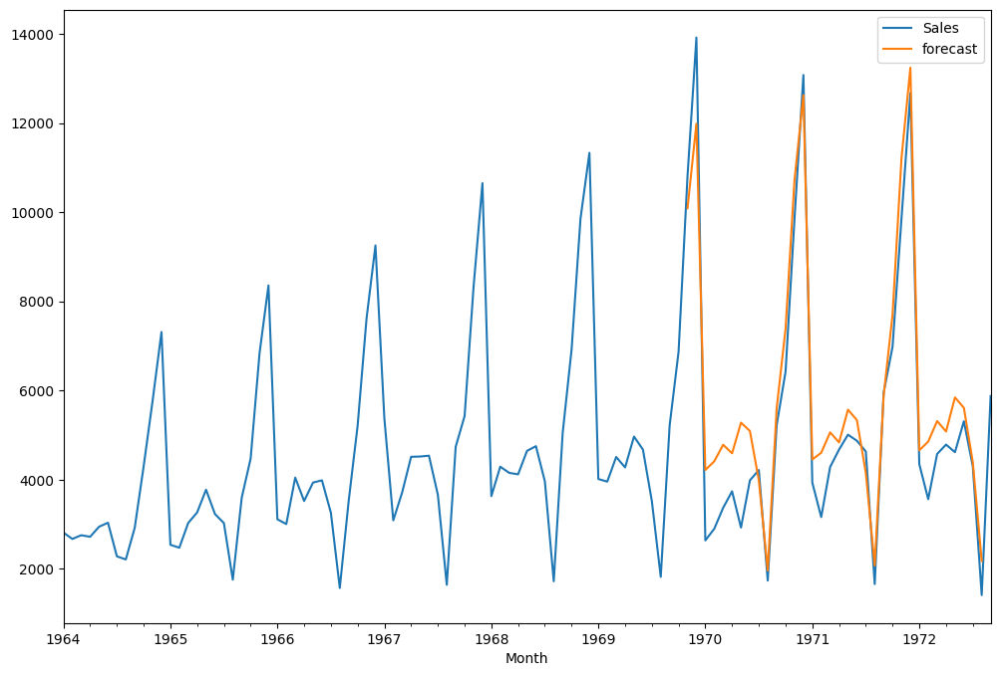
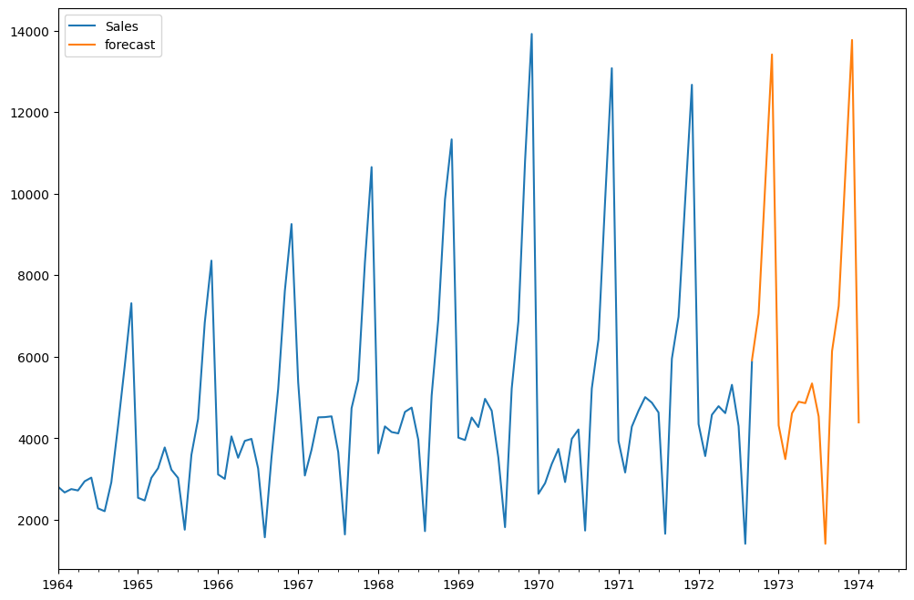

# 📈 Time Series Forecasting using ARIMA & SARIMA


---

## 📌 Project Overview

This project demonstrates **Time Series Forecasting** using:

- 🔹 ARIMA (AutoRegressive Integrated Moving Average)
- 🔹 SARIMA (Seasonal ARIMA)

The implementation is done entirely in a **Jupyter Notebook (.ipynb)** and covers:

✔ Data preprocessing  
✔ Stationarity testing (ADF Test)  
✔ Model building  
✔ Forecasting  
✔ Visualization  

---

## 🎯 Objectives

- Understand time series components
- Perform stationarity testing
- Apply differencing techniques
- Build ARIMA model
- Build SARIMA model
- Generate future forecasts
- Compare model outputs

---

## 📊 Project Workflow

1️⃣ Import dataset  
2️⃣ Convert Date column to datetime  
3️⃣ Set Date as index  
4️⃣ Plot original time series  
5️⃣ Perform Augmented Dickey-Fuller (ADF) test  
6️⃣ Apply differencing (if required)  
7️⃣ Train ARIMA model  
8️⃣ Train SARIMA model  
9️⃣ Forecast future values  
🔟 Visualize predictions  

---

## 📂 Repository Structure

```
Time-Series-Forecasting-ARIMA-SARIMA/
│
├── Arima-Sarima.ipynb
├── requirements.txt
└── README.md
```

---

## 🛠 Technologies Used

- Python
- Jupyter Notebook
- Pandas
- NumPy
- Matplotlib
- Seaborn
- Statsmodels

---

## 📦 Installation

Clone the repository:

```bash
git clone https://github.com/your-username/Time-Series-Forecasting-ARIMA-SARIMA.git
cd Time-Series-Forecasting-ARIMA-SARIMA
```

Install dependencies:

```bash
pip install -r requirements.txt
```

Launch Jupyter Notebook:

```bash
jupyter notebook
```

Open:

```
Arima-Sarima.ipynb
```

---

## 📈 Model Implementation

### 🔹 ARIMA Model
- Order (p, d, q)
- Handles non-seasonal data patterns
- Uses lagged values + error terms

### 🔹 SARIMA Model
- Order (p, d, q)
- Seasonal Order (P, D, Q, s)
- Captures seasonality in data

---

## 📊 Output

The notebook generates:

- 📈 Original Time Series Plot
- 📉 Differenced Series Plot
- 📊 ARIMA Forecast Plot
- 📊 SARIMA Forecast Plot
- 📑 Statistical Summary Output

---

## 📷 Sample Output Section (Optional)

If you add screenshots in a folder called `screenshots/`:

```markdown
## Forecast Output



```

---

## 📦 requirements.txt

Create a file named `requirements.txt` with:

```
pandas
numpy
matplotlib
seaborn
statsmodels
jupyter
```

---

## 🔮 Future Enhancements

- Hyperparameter tuning using AIC/BIC
- Grid Search for optimal SARIMA parameters
- Model evaluation metrics (RMSE, MAE)
- Auto ARIMA implementation
- Deploy as Streamlit forecasting app

---

## 👩‍💻 Author

**Nighitha T N**

---

⭐ If you found this project useful, consider giving it a star!
